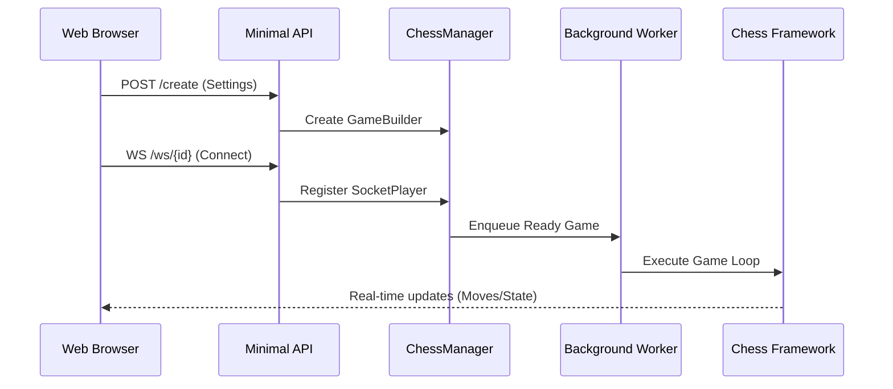
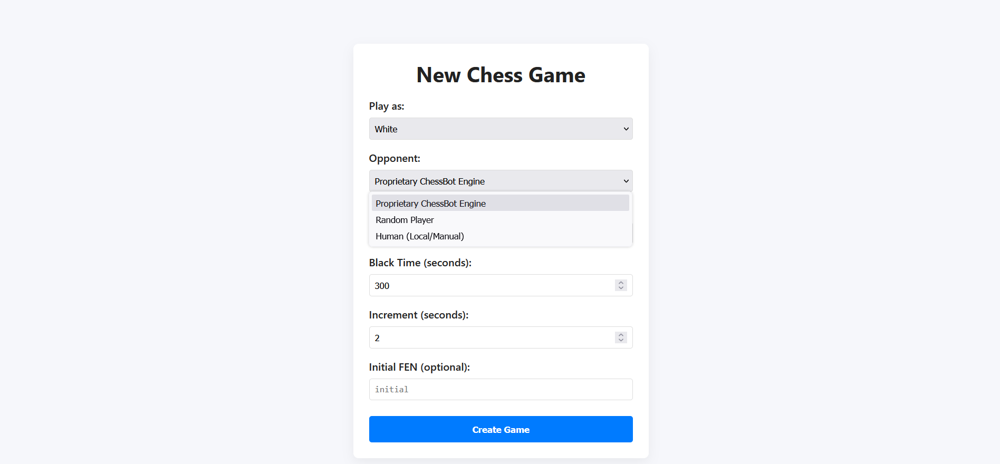
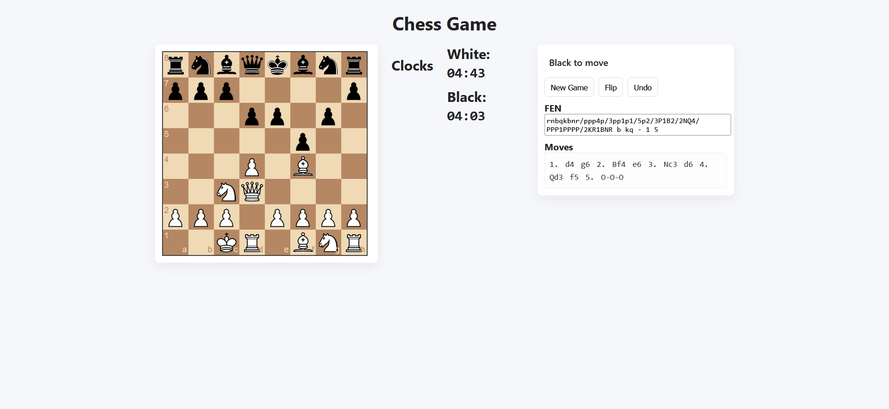

# Chess server

A web-based showcase for a custom C# chess framework, demonstrating real-time gameplay through a multi-threaded ASP.NET Core backend.

## Overview

This repository serves as a practical demonstration of my [Chess Framework](https://github.com/salvatob/parallel-chess-bot). While the framework handles the core chess rules, move validation, and engine logic, this application provides the infrastructure required to expose that logic to the web. That also means, that this backend could, with just a minor change, be used to host a variety of different games, as long as they follow a simple structure of: connect players-play-discard.

The project focuses on backend engineering challenges: managing concurrent game states, handling persistent WebSocket connections, and orchestrating communication between human players and automated engines within a thread-safe environment.

## Technical Highlights

*   **ASP.NET Core & Minimal APIs:** Leveraging a lightweight web stack for game orchestration and static asset hosting.
*   **Real-time WebSockets:** Bidirectional communication between the client and backend, encapsulated within a custom `SocketPlayer` abstraction.
*   **Producer-Consumer Architecture:** Utilizing `System.Threading.Channels` to decouple game creation from execution, allowing a pool of background workers to process active games.
*   **Concurrency & Thread Safety:** Robust management of concurrent game builders and active sessions using `ConcurrentDictionary` and `Interlocked` operations.
*   **Asynchronous Programming:** Extensive use of `async/await` for non-blocking I/O and resource-efficient task management.
*   **Dependency Injection:** Clean separation of concerns, injecting the central `ChessManager` to coordinate the application lifecycle.
*   **Framework Integration:** Seamlessly consumes the core chess library through a shared `IPlayer` interface, enabling interchangeable opponents (Human, Random, or Engine).

## Architecture

The application acts as a bridge between stateless web requests and the stateful, long-running nature of a chess game. It uses a producer-consumer pattern to manage games efficiently without blocking the web server.



### Key Components

1.  **Orchestration (`ChessManager`):** The central hub that manages the lifecycle of all games. It handles the transition from an initial HTTP request to a fully initialized game session.
2.  **Game Building:** Since a game requires two players (which might arrive at different times via different protocols), a `GameBuilder` acts as a temporary container to synchronize setup before the game begins.
3.  **Concurrency Model:** Instead of spawning a new thread for every game, ready games are pushed into a `System.Threading.Channel`. A fixed pool of background workers consumes this channel, executing the game logic asynchronously.
4.  **Player Abstraction:** The backend treats all opponents identically through an `IPlayer` interface. Whether a player is a remote human via WebSockets or a local AI engine, the core game loop remains unchanged.


## Screenshots


*Configure game parameters and choose opponents*


*Real-time interaction via WebSockets*


## Running Locally

### Prerequisites
*   [.NET 9.0 SDK](https://dotnet.microsoft.com/download/dotnet/9.0)
*   The [Chess Framework](https://github.com/salvatob/parallel-chess-bot) repository cloned locally.

### Development Setup
This project currently consumes the chess framework via a local project reference. For the solution to compile, the framework repository must be located in the sibling directory:

`../ParallelChessBot/ChessBotCore/ChessBotCore.csproj`

1.  **Clone this repository:**
    ```bash
    git clone https://github.com/salvatob/chess-server.git
    cd chess-web-showcase
    ```
2.  **Restore and Build:**
    ```bash
    dotnet build
    ```
3.  **Run the application:**
    ```bash
    dotnet run --project App
    ```
4.  **Access the UI:**
    Open your browser and navigate to `http://localhost:5000` (or the port indicated in the terminal output).

## Project Structure

*   `/App`: The main ASP.NET Core web application.
    *   `/wwwroot`: Vanilla JS frontend and assets.
    *   `ChessManager.cs`: Central orchestrator for game lifecycles.
    *   `SocketPlayer.cs`: WebSocket wrapper implementing the framework's player interface.
*   `/App.UnitTests`: Suite of tests for backend logic and concurrency.
*   `/docs`: Additional technical documentation.

## Chess Framework

The core chess logic is housed in a separate repository:
**[Parallel Chess Bot](https://github.com/salvatob/parallel-chess-bot)**

This framework includes:
*   Efficient bitboard-based board representation.
*   Legal move generation and FEN parsing.
*   A parallelized search engine for move evaluation.
*   Standardized interfaces for human and AI players.

